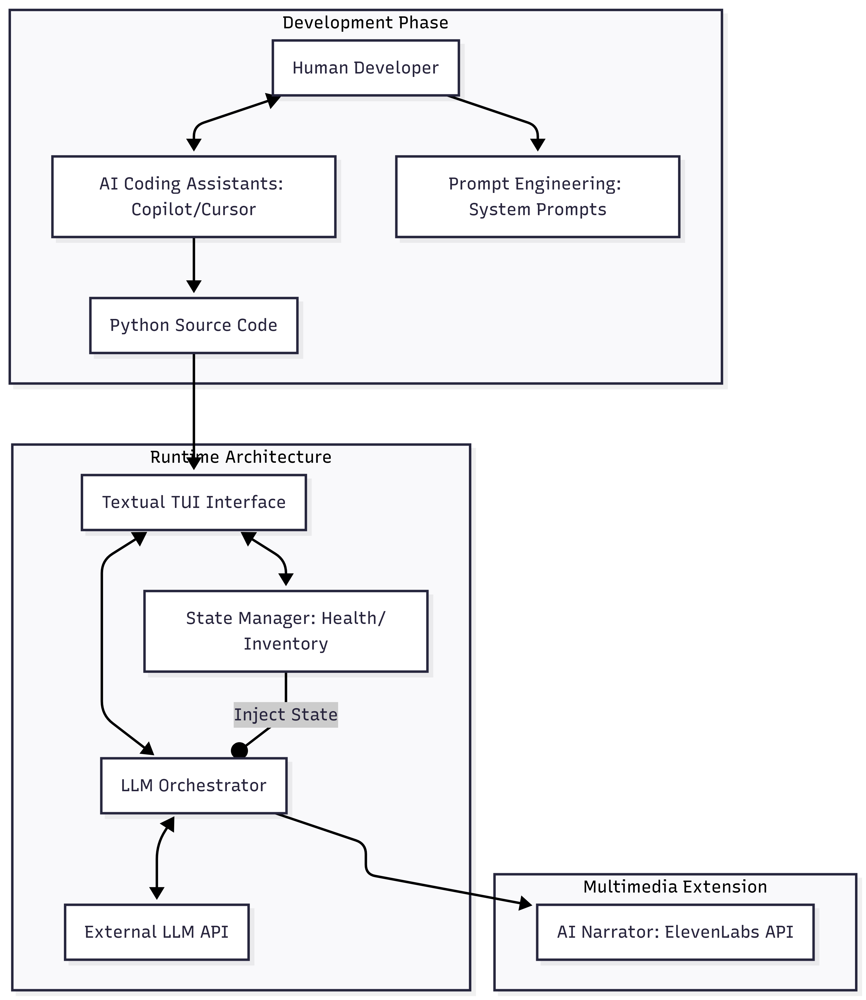
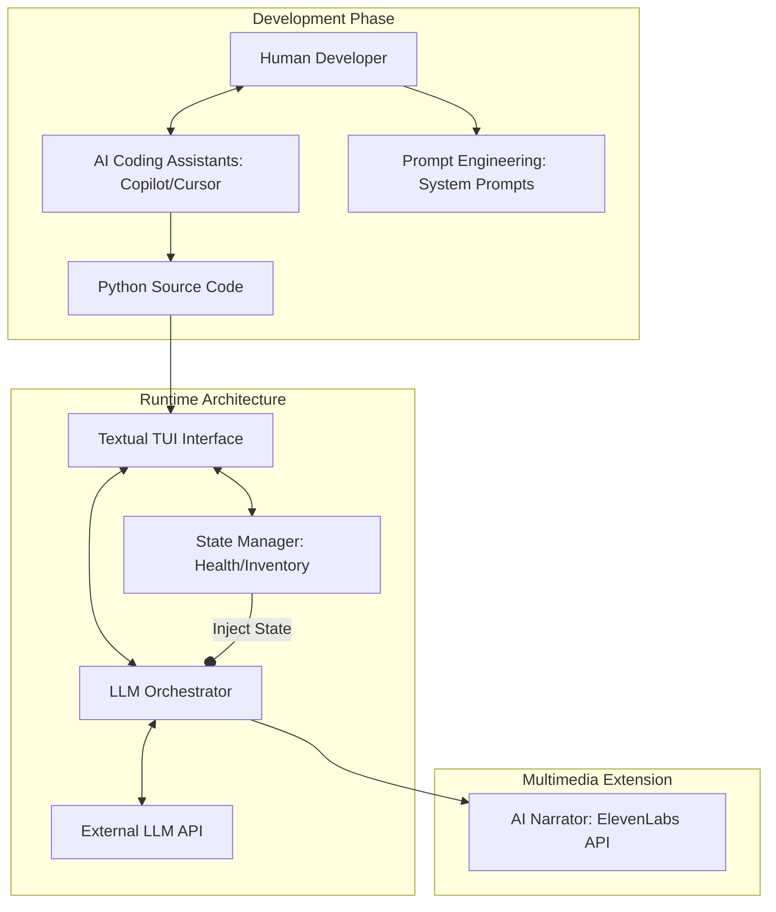

# Project Proposal: Narrative Engine for RPGs

## 1. Goal of the Project

### High-Level Goal & Validation
The goal is to develop an AI-powered narrative engine for RPGs that bridges the gap between deterministic game mechanics (mathematical rules) and non-deterministic storytelling (generative LLMs).

**Validation:** The project will be validated through a successful "Campaign Run" where the system maintains state integrity (e.g., an LLM-narrated event correctly reflects a player's previous item loss) and passes automated unit tests designed to catch state-narrative desynchronization.

### System, Feature, or Workflow
We will develop a Textual User Interface (TUI) application in Python. The workflow follows a reactive event loop:
1. **State Update:** The deterministic engine processes player stats, inventory updates, and dice rolls.
2. **Context Injection:** The current game state is serialized into a JSON context payload.
3. **Narrative Generation:** An external LLM (via API) generates a story response constrained by the injected context.
4. **UI Rendering:** The TUI updates specific interface widgets (Sidebar, Narrative Log, Health Bars) asynchronously.

### AI Assistance in the Development Process
This project focuses heavily on AI-assisted software engineering methodologies:
* **Requirements & Architecture (ChatGPT/Claude):** Used to generate JSON schemas for state-to-prompt serialization and to draft the initial object-oriented class structure for the TUI components.
* **Implementation (GitHub Copilot/Cursor):** Utilized as an inline pair programmer to handle boilerplate generation, asynchronous API routing, and TUI CSS styling.
* **Quality Assurance (LLM-Based Testing):** AI tools will be prompted to generate "Chaos Tests"—simulated edge-case user inputs designed to stress-test the LLM's narrative constraints and validate the deterministic math engine.

### Development & Architecture Diagram

## 2. Project Plan
* Phase 1: Foundation(Define State Schemas, Design TUI Layout (TCSS), Setup API connectivity)
* Phase 2: Core Logic(Implement State Manager (Health, Dice, Items) & basic LLM API loop)
* Phase 3: Integration(Connect Exploration and Combat modules. Implement context-aware prompt injection)
* Phase 4: Polish(Integrate AI-generated audio/images. Conduct "Chaos Testing" and bug fixing)
* Phase 5: Delivery(Finalize documentation and prepare the presentation)

## 3. Teamwork and Responsibilities
As a two member team we have divided the work in a way that both members deal with dynamically AI generated aspects and determnistic systems programming.

### Philipp Borbely: Exploration & World-State Engineer
Responsibilities: 
* Develop the Narrative Engine logic (tracking world flags, NPC status, location context).

* Build the main Story TUI Widgets and dialogue handling within the UI.

* Manage the System Prompts for non-combat storytelling and world-building.

AI Dev Focus: Utilizing AI assistants for UI component generation and designing complex narrative branching logic structures.

### Lawrence Federsel: Combat & Resource Engineer
Responsibilities:

* Develop the Deterministic State Engine (HP, Mana, Inventory arrays, mathematical combat resolution).

* Build the Stats Sidebar & Inventory TUI Widgets.

* Manage the Combat Prompts (translating deterministic dice rolls and damage into coherent narrative descriptions).

AI Dev Focus: Utilizing AI for automated unit testing of core game mechanics and generating the underlying data structures for items/enemies.